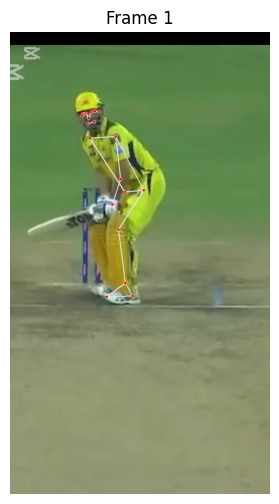
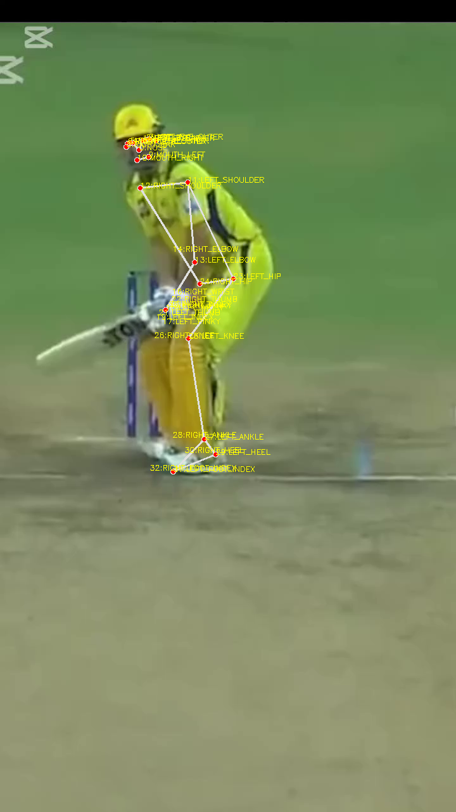
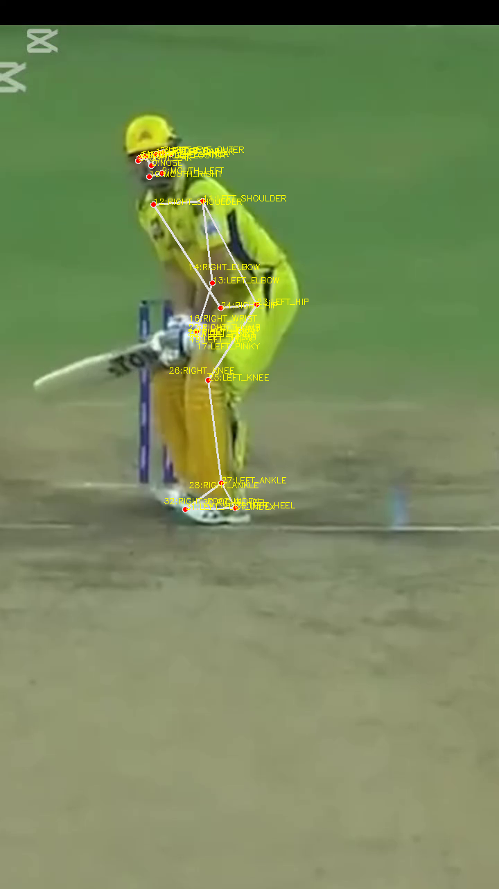
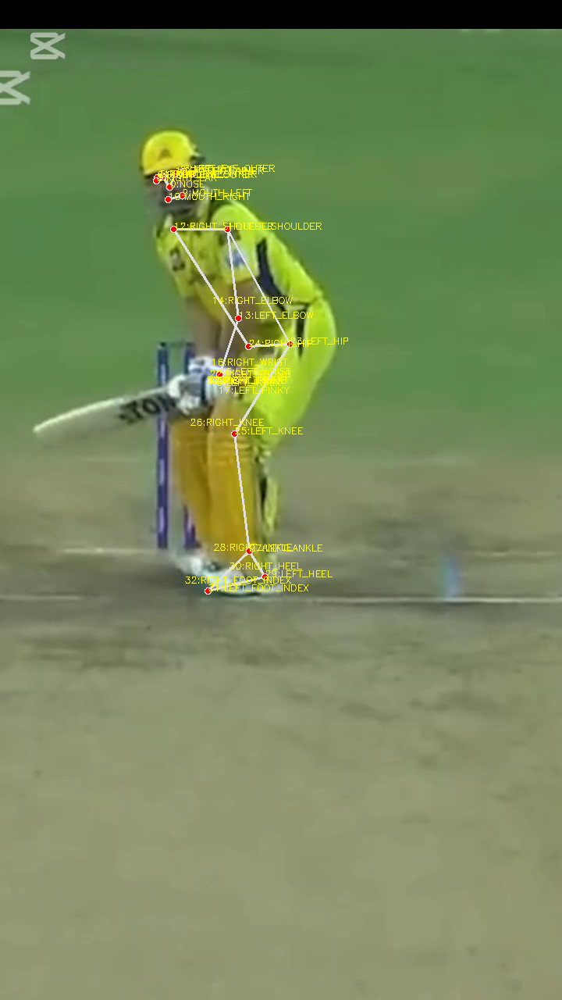
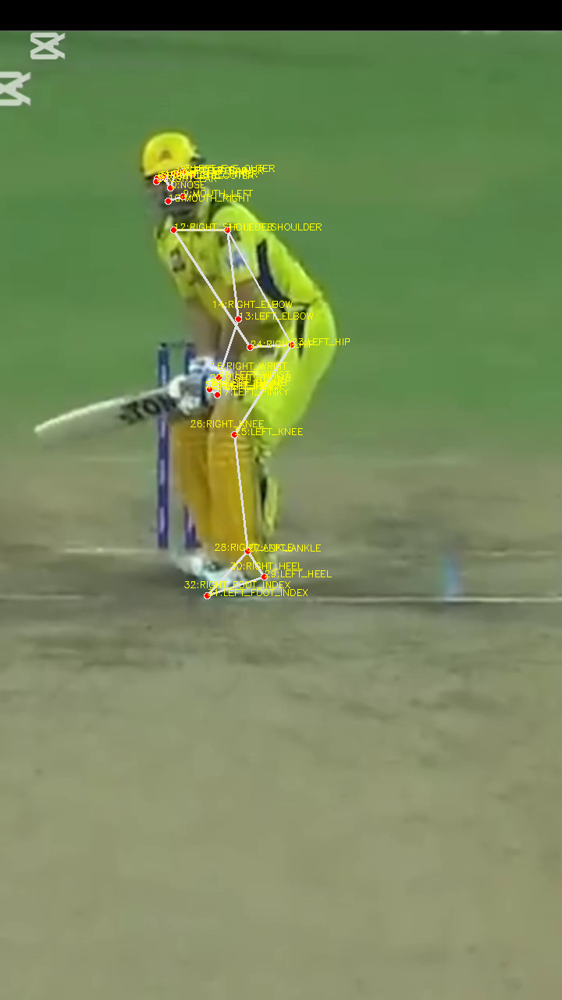
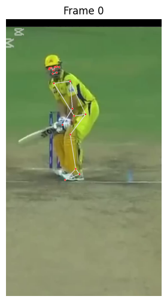

# 🏏 Cricket Pose Estimation using Mediapipe

This project uses **Google Mediapipe** to extract skeleton pose landmarks of cricketers (batsman, wicket-keeper) from a recorded cricket video.

## 🚀 Project Demo

Sample overlay of body landmarks:









## ⚙️ How to Run

1. Clone the repository:
```bash
git clone https://github.com/your-username/CricketPoseEstimation.git
cd CricketPoseEstimation
```

## 📌 Technologies Used
```Mediapipe

OpenCV

Python

Google Colab 
```


------

## **🧑‍💻 Author**
- **Sukanta Nag Hirock**
- CSE Undergrad | ML Enthusiast | Data Analyst in the Making | AI Science | Data Scientist
- [LinkedIn](https://www.linkedin.com/in/sukanta-hirock-0bb15a34a) | [Portfolio](https://github.com/sukantahirock)
- [mail me](haridasnag01715511031@gmail.com)

------


## 🧠 Mediapipe আসলে কী?
Mediapipe হল Google বানানো একটা machine learning pipeline framework, যেটা real-time human pose, face, hands ইত্যাদি detect করতে পারে।

------
## 🤔 কিভাবে **Mediapipe** এর Pose মডেল কাজ করে?
এখানে পুরো জাদুটা হয় **Pose Estimation** দিয়ে। Mediapipe-এর Pose module-এর ভিতরে দুই ধাপের কাজ হয়:

------
🧩 Step 1: Person Detection
প্রথমে একটা lightweight CNN (Convolutional Neural Network) দিয়ে ছবি বা ভিডিওর ফ্রেমে মানুষ আছে কিনা ও কোথায় আছে সেটা detect করে।

🦴 Step 2: Pose Landmark Regression
তারপর detected ব্যক্তির ভিতরে:

33টা key landmarks (joint points) বের করে:

যেমন: nose, shoulders, elbows, wrists, hips, knees, ankles ইত্যাদি

প্রতিটা landmark এর (x, y, z, visibility) coordinate বের করে

এরপর একে একে landmark গুলো connect করে একটা skeleton-style কংকাল বানায়

📦 Mediapipe যা যা ব্যবহার করে:
Component	Role
- 📸 OpenCV	ছবি/ভিডিও input নেওয়ার জন্য
- 🤖 CNN	মানুষের অবস্থান ও joint detect করতে
- 🔀 Custom Graph	Speed এবং accuracy বজায় রাখতে
- 🧠 BlazePose model	Fast & accurate pose landmark detector
